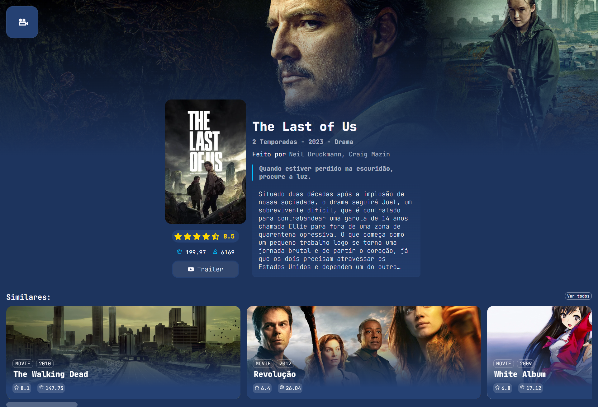

# Projeto React - CineBoxd

## 📝 Descrição

Este projeto foi desenvolvido como atividade avaliativa da disciplina de Programação Web II do curso de Análise e Desenvolvimento de Sistemas. O objetivo principal foi construir uma interface utilizando  React e consumindo uma API de filmes para listar e ver detalhess dos mesmos.

## 📸 Prévia do layout

<div class="home">
  
</div>
<div class="details">
  
</div>

## 📦 Como Executar o Projeto

### Clone o repositório:

```bash
git clone https://github.com/GustavoDeltta/ads-progweb-layout.git
```

### Acesse o diretório do projeto:

```bash
cd ads-progweb-cineboxd
```

### Instale as dependências:

```bash
npm install
```

### Instale as dependências:

```bash
cp .env.example .env
# Edite o .env e adicione sua chave de API:
VITE_TMDB_API_KEY=<sua_chave_tmdb>
```

### Inicie o servidor de desenvolvimento:

```bash
npm run dev
```

### Acesse a aplicação:

-  Abra o navegador e vá até ``http://localhost:5173``para visualizar.
